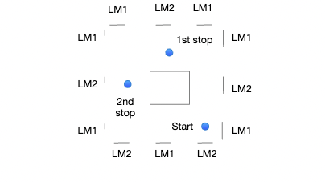
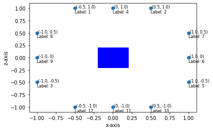
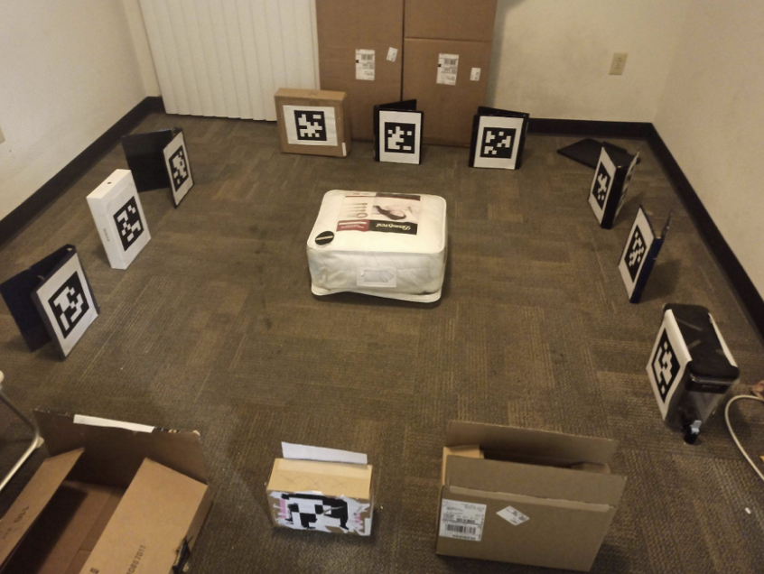

# Path-planning-using-voronoi-diagrams-for-JetBot

## Task
An environment is given which has april tags at its edges and an obstacle in the middle. I couldn’t afford a 10ftx10ft space so like hw2/3, I’m doing this homework in the 2m x 2m space. Following is the pictorial representation of the arena and its corresponding image.
     

### Voronoi Based Planning Algorithm
To achieve the task mentioned in the above section, Voronoi Diagrams based approach is used in this homework. For the obstacle placed at the center of the arena, few points on the obstacle are taken which represents the obstacle and the 12 april tag markers are treated as obstacles as well. The voronoi diagram is created using the voronoi function in matlab. Kindly refer to compute_voronoi.m. In the resulting voronoi diagram, the path segments which are passing through the obstacle at the center are removed. The path segments are also confined to the arena space by truncating the path segments which go outside the arena. The following is the final outcome of the processing of the voronoi diagram. The complete processing for voronoi diagrams is performed in spatial_vornoi.ipynb.

The voronoi Diagram is represented as a graph with nodes shown above in numbers. There are two dictionaries provided in spatial_voronoi.ipynb :- Nodes_dict and Edges_dict. Nodes_dict is mapping of the node number in the voronoi diagram(mentioned in the above diagram) with its coordinates and Edges_dict is the mapping from the edge number to the vertices joining it.
Nodes_dict and Edges_dict are given to the planner_node.py for planning the path. The start position of the robot is taken as Node 1 and its initial orientation is parallel to the +x-axis, First stop is taken as node 7 and Second stop is taken as Node 11.

### Planning Algorithm
This planning algorithm has been implemented in ROS and Python. A ROS node planner_node.py is the one that manages the whole planning operations. There is a localization_node.py as well which uses the april tags detection to localize the robot.
Following are the steps of the planning algorithm :-
1. First using the networkx library in Python, an undirected graph is computed from the
Edges_dict in planning_node.py. The weight of an edge is assigned as the euclidean
distance of its two endpoints.
2. A shortest distance path between first node and first stop is computed using the
Djikstra’s algorithm using nx.dijkstra_path(G, 1 , 7). The output of this function is the list of nodes which the robot has to traverse. This is similar to the task we had in homework 2 where we were given a set of waypoints and using the april tags we have to trace those waypoints.
3. Starting from the node 1 with its orientation parallel to the x-axis, the robot starts moving to the nodes one-by-one in the path computed in step 2. The robot motion is discretized in 0.3 seconds time steps and for each time step and robot motion is achieved by decomposing it into rotation and translation. Due to some issues with the jetbot discussed in the Limitations section, for different rotation angles and different distances, discretized functions are used which return the motor values to achieve desired range of rotation or translation. I have written detailed reasoning for doing this. Kindly refer to the Limitations section.
4. localization_node.py also runs parallely with planner_node.py. When the robot is moving, the planner node publishes the toggle_detection topic which is a message that localization_node stops any detection while the robot is moving. When robot made its move and comes to a stop, then it gives a window of 600ms to the localization_node by again publishing on the topic toggle_detection in move_robot_util() which now allows the localization_node to perform the localization of the robot using the april tags detected. localize_robot_using_marker() function in localization_node.py accepts three arguments:- rotation matrix, translation matrix and the marker object and returns the position(x and z coordinates) and the orientation of the robot(angle it makes with x-axis) from the world coordinate frame of reference. The new robot pose is published by localization_node.py on the topic pose_robot and this topic is subscribed by planner_node which updates the robot’s pose whenever there is an update on this topic using set_robot_pose_callback(). Hence after every move, the robot’s pose w.r.t world coordinate frame is known and it has to move to the next node/waypoint for which the new target angular orientation and distance is computed in the cover_waypoints() function in planner_node.
5. After the robot reaches the first stop, it stops for 5 seconds to mark it as a stop. Then it computes the path from first stop node 7 to second stop node 11 again using Djikstra’s algorithm which again returns a set of nodes(waypoints) to traverse to reach the second stop in the similar fashion as it reaches the first stop.

### Results

If we compare the video and the processed voronoi diagram, we can see that the robot’s motion is along the path that was found by the Djikstra’s algorithm. There are some slight angular deviations during robot’s locomotion and a horizontal drift can also be seen especially during the last second journey from from the first stop to second stop(Although the robot reached a position which has similar z-coordinate as Node 11 but it is little closer to the obstacle.

### Code Description:
localization_node.py:- Notable functions and classes are:-
1. tag_callback3()
2. process_detected_tag3()
3. Marker4 class:- a class to represent a marker object. Contains position of the marker
and change of frame matrix from marker’s frame to world coordinate frame.
4. localize_robot_using_marker()
5. markers4_dict: dictionary of all the Marker4 objects each representing a placed marker
planner_node.py:-
1. Nodes_dict
2. Edges_dict
3. rotate_robot()
4. translate_robot()
5. move_robot_util()
6. get_shorter_angle()
7. cover_waypoints()
8. Robot class:- a class to represent robot object. Contains robot’s pose(x,z and theta).
